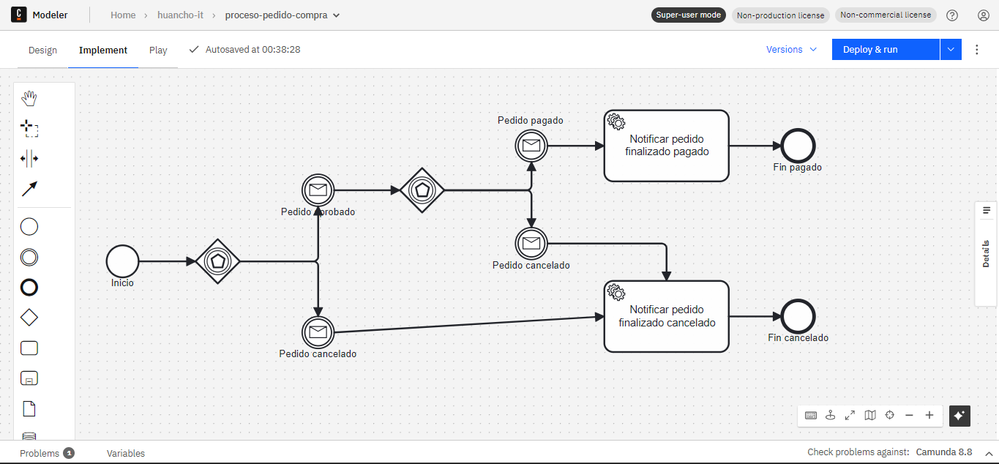
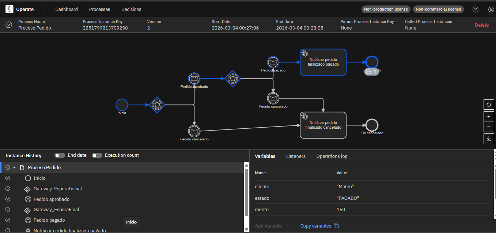
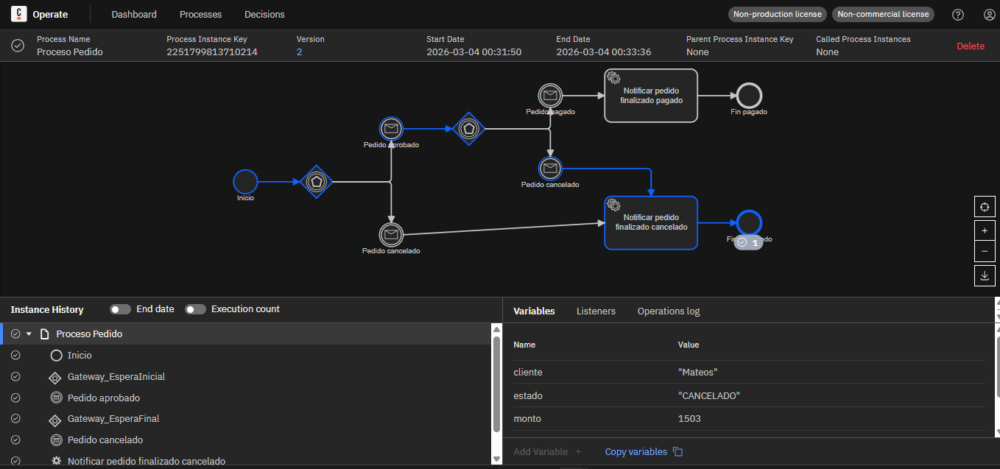

# Getting Started
URL: OPERATOR http://localhost:8080
URL: CREAR DIAGRAMA http://localhost:8070/

### Reference Documentation
BPMN 
#### Crear pedido
curl --location 'http://localhost:4222/api/pedidos' \
--header 'Content-Type: application/json' \
--data '{
"cliente": "Mateo",
"monto": 150
}'

### Aprobar 
curl --location --request POST 'http://localhost:4222/api/pedidos/1/aprobar'
### Pagar
curl --location --request POST 'http://localhost:4222/api/pedidos/1/pagar'

### Cancelar
curl --location --request POST 'http://localhost:4222/api/pedidos/1/cancelar'
### Consultar
curl --location 'http://localhost:4222/api/pedidos/1'

proceso:
Start
espera pedido-aprobado o pedido-cancelado
si aprueban:
espera pedido-pagado o pedido-cancelado
al final:
ejecuta notificar-pedido-finalizado
termina

Criterio:
iniciar pedido → crea la instancia y deja el proceso esperando
aprobar pedido → correlaciona pedido-aprobado
pagar pedido → correlaciona pedido-pagado
cancelar pedido → correlaciona pedido-cancelado

